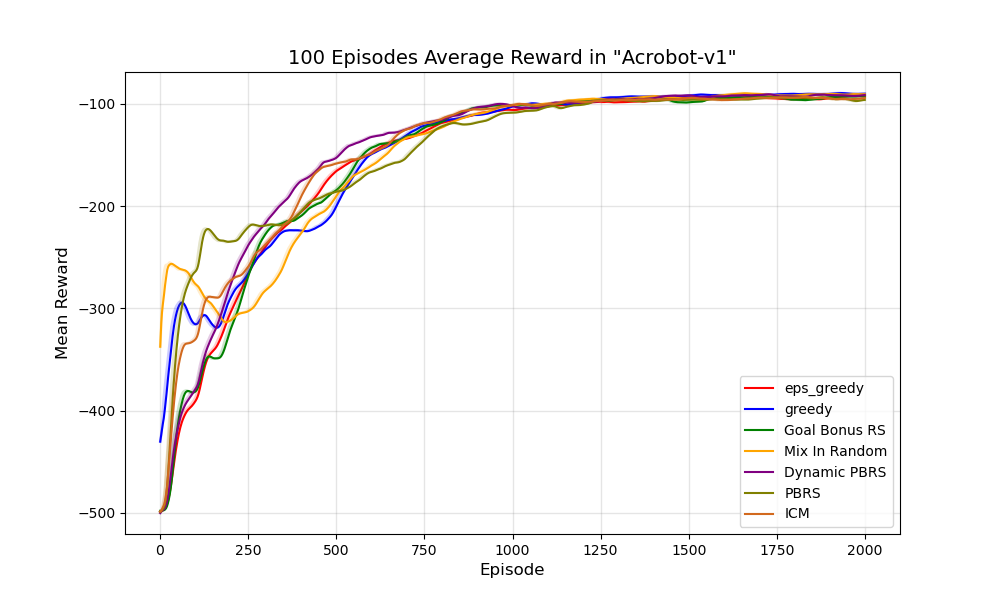
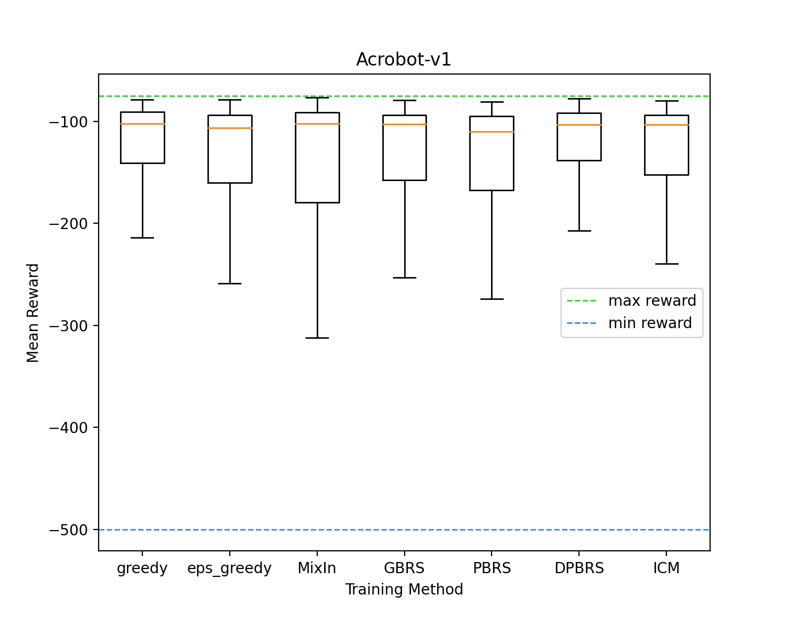
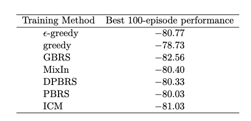
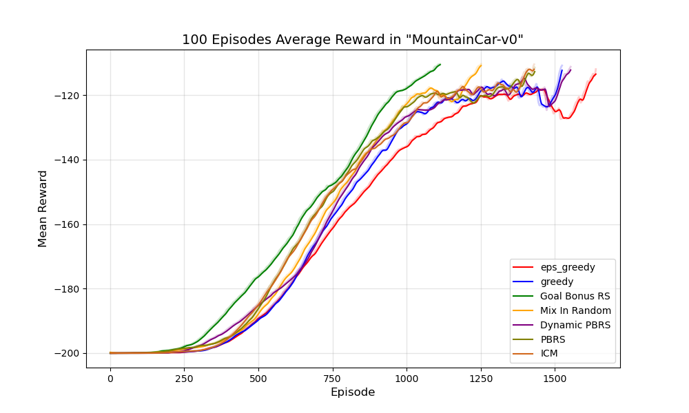
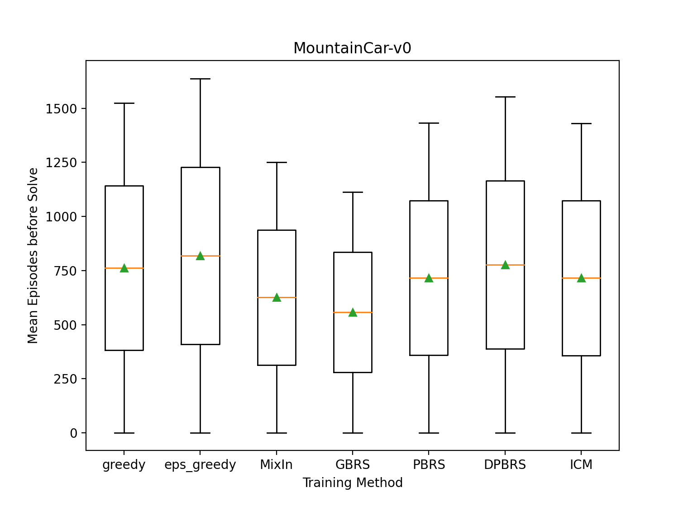
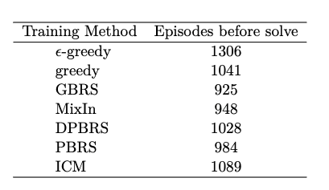
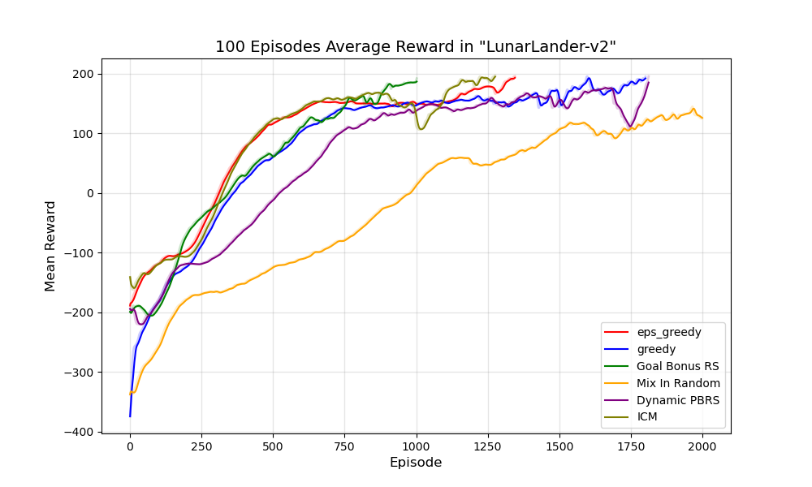
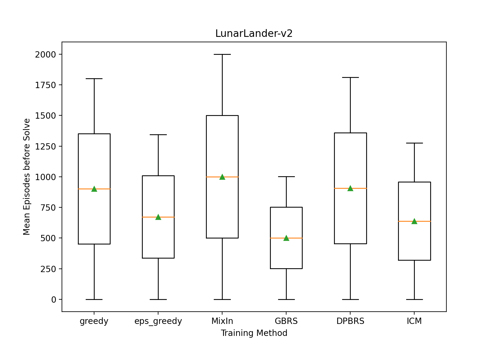
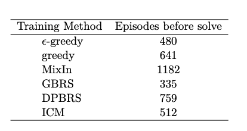

# Reward Shaping for optimal Exploration in Reinforcement Learning

A common method to solve the efficiency problem in reinforcement learning is reward shaping, i.e., transforming possible domain knowledge into additional rewards and guiding learning algorithms to learn faster and better by using the combination of the original and the new rewards. 

In this repository, in addition to Potential Based Reward Shaping (PBRS), several reward shaping techniques are presented and applied.

For training, RL's most popular learning algorithm is used: Deep Q-Network (DQN).

## Setup
### Requirements
- Python-3.8
- PyTorch-1.9.1
- Gym-0.19.0

#### First clone the repository and navigate to the project folder
```Shell
  git clone https://github.com/lilianekabboura/Reward-shaping-in-RL.git
  ```
#### Install Dependencies
```Shell
  pip install --upgrade pip
  pip install -r requirements.txt
  ```
## Running Code
### Training

| Flags and Parameters  | Description |
| ------------- | ------------- |
| ``--policy <STRING>``  | Policy to use for training. Choose between 'epsilon_greedy' or 'greedy'. (default: epsilon_greedy). |
| ``--shaping_method <STRING>``  | Include shaping method in training. Choose between 'no_shaping', 'GBRS', 'MixIn', 'DPBRS', 'PBRS'. (default: no_shaping).
| ``--num_episodes <INT>``  | Maximum number of episodes for training. (default: 2000). |
| ``--save_model <BOOL>``  | Boolean to specify if the trained network shall be saved. (default: False).  |
| ``--runs <INT>``  | Number of runs should be performed. (default:1). |
| ``--env_render <BOOL>``  |  Boolean to enable environment rendering during training. (default: False).  |
| ``--seed <INT>``  | Random seed to reproduce training runs. (default: 1). |
| ``--curiosity <INT>``  | Adding intrinsic curiosity to the extrinsic reward. Choose between 0:no curiosity, 1:reward and curiosity, 2:only curiosity. (default: 0).  |
| ``--deep_logging <BOOL>``  | Boolean to enable deep logging of visited states during training for the purpose of statistics. (default: False).  |
| ``--cal_int_re <BOOL>``  | Boolean to enable intrisic reward calculation when ICM is not applied. (default: False).  |

*there is no required argument.*
### Training Examples
**first navigate to Code/scripts/training folder**
- train MountainCar-v0 with epsilon greedy policy without reward shaping and default parameters
```
python train_MountainCar.py
```

- train MountainCar-v0 with greedy policy and render the environment
```
python train_MountainCar.py --policy greedy --env_render True
```
- Train Acrobot-v1 with Epsilon Greedy and GBRS reward shaping method for 5 runs of 1000 epidodes each, and save the trained model.
```
python train_Acrobot.py --policy epsilon_greedy --shaping_method GBRS --num_episodes 1000 --runs 5 --save_model True
```
- Train LunarLander-v2 with epsilon greedy policy and ICM model and enable Deep Logging to log visited states.
```
python train_LunarLander.py --curiosity 1 --deep_logging True
```

### Visualization

| Flags and Parameters  | Description |
| ------------- | ------------- |
| ``--env <STRING>``  | Name of the environment. Choose between 'Acrobot-v1', 'MountainCar-v0' or 'LunarLander-v2'. |
| ``--training_method <STRING>``  | Method used for training. Choose between 'epsilon_greedy' 'GBRS', 'MixIn', 'DPBRS', 'PBRS', 'ICM'. (default: epsilon_greedy).
| ``--num_episodes <INT>``  | Maximum number of episodes to be executed. (default: 10). |
| ``--run_num <INT>``  | The number of the run of the trained model. (default: 0). |

*the only required argument is --env.*

### Visualization Examples
**first navigate to Code/scripts/training folder**

- visualize the Acrobot-v1 trained model for a run that has the number 3 and used MixIn as shaping method for 10 episodes 
```
python visualize.py --env Acrobot-v1 --training_method MixIn --num_episodes 10 --run_num 3
```
## Results
### Acrobot-v1
**Agent’s performance using the different training methods after 2000 episodes of learning over 20 conducted runs.**

<p float="left">
  
   
</p>

**The best average over 100 consecutive episodes from the 20 performed runs for each method.**



### MountainCar-v0
**Agent’s performance using the different training methods for a maximum of 2000 episodes of learning over 20 conducted runs.**

<p float="left">
  
   
</p>

**The best runs from the 20 runs performed for each method.**



### LunarLander-v2
**Agent’s performance using the different training methods for a maximum of 2000 episodes of learning over 20 conducted runs.**

<p float="left">
  
   
</p>

**The best runs from the 20 runs performed for each method.**


